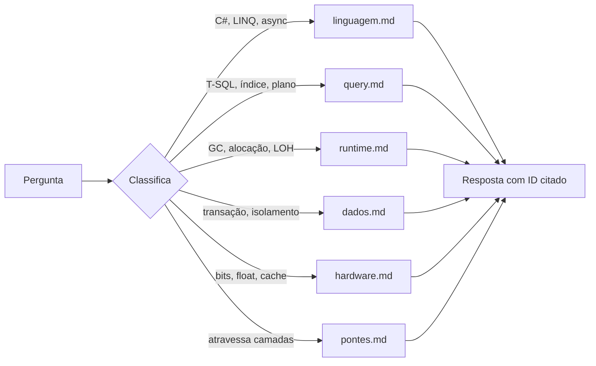

<div align="center">

# dotnet8-senior

**Um revisor de código .NET 8 que recusa dar número sem medição.**

Base de conhecimento destilada de cinco livros técnicos — com 26 itens provados
por execução real, não por opinião de modelo.


[](https://www.skills.sh/HenriqueVMonteiro/dotnet8-senior-agent)

```bash
npx skills add HenriqueVMonteiro/dotnet8-senior-agent
```

</div>

---

## Por que isto existe

Três extrações independentes dos livros concordaram que **"UDF escalar mata o
paralelismo no SQL Server"**. É o que todo blog post repete.

Todas as três estavam erradas. O experimento pegou:

| `compatibility_level` | elapsed | paralelismo |
|---|---:|---|
| 140 | 56.471 ms | não |
| **160** (default do SQL Server 2022) | **321 ms** | **sim** |

Mesma UDF, mesma tabela de 6.901.129 linhas. O *scalar UDF inlining* remove a
função do plano a partir do nível 150. A recomendação de reescrever sobrevive —
o predicado sargável ainda é 5,4x mais rápido — mas **o mecanismo que todos
citam está errado**.

Consenso entre modelos decorrela desleixo, não crença errada. Só medição faz isso.
É esse o princípio do projeto inteiro.

---

## Índice

- [O que ele faz diferente](#o-que-ele-faz-diferente)
- [Instalação](#instalação)
- [Como funciona](#como-funciona)
- [A base de conhecimento](#a-base-de-conhecimento)
- [O que a medição contrariou](#o-que-a-medição-contrariou)
- [Reproduzir a verificação](#reproduzir-a-verificação)
- [Estrutura do projeto](#estrutura-do-projeto)
- [Avisos importantes](#avisos-importantes)
- [Próximos passos](#próximos-passos)
- [Licença e origem](#licença-e-origem)

---

## O que ele faz diferente

**Recusa número sem medição.** Pergunte "quanto mais rápido fica com Dapper" e
ele explica o mecanismo, aponta em que camada do diagnóstico você está olhando
errado, e diz exatamente o que medir. Não estima percentual.

**Pede o contexto que falta.** Volume real das tabelas, índices existentes, nível
de isolamento, Server ou Workstation GC, p99 aceitável. Sem poder perguntar,
declara a suposição na primeira linha.

**Não emite recurso fora do alvo.** Pediu `field` keyword ou
`System.Threading.Lock` (C# 13)? Entrega o equivalente em C# 12 e menciona em uma
linha que existe algo melhor depois.

**Cita a origem, e discorda com ID.** Cada afirmação carrega o item que a
fundamenta. Ao contrariar um item da base, cita o ID e explica por que o caso é
exceção — inclusive quando a base contradiz a si mesma.

**Declara o que não sabe.** Numa revisão real de projeto MySQL, ele encerrou com:
*"não sei se o MySqlConnector vaza nível de isolamento pelo pool como o SqlClient
faz. Não vou chutar."* — e propôs o teste observacional.

---

## Instalação

Duas rotas. Elas entregam coisas diferentes — escolha pelo que você quer.

### Como skill — 77 agentes suportados

```bash
npx skills add HenriqueVMonteiro/dotnet8-senior-agent
```

Instala via [`npx skills`](https://github.com/vercel-labs/skills), o CLI do
ecossistema aberto de skills. Funciona em Claude Code, Codex, Cursor, OpenCode,
Zed, Cline, Warp e [73 outros](https://github.com/vercel-labs/skills#supported-agents).
Sem clone, sem dependência, sem conta. Repo público.

A base viaja dentro da skill e é referenciada por caminho relativo — nada é
reescrito, nada aponta para fora. `npx skills update` atualiza depois.

```bash
npx skills add HenriqueVMonteiro/dotnet8-senior-agent -g          # global, todos os projetos
npx skills add HenriqueVMonteiro/dotnet8-senior-agent -a codex    # só um agente
npx skills update dotnet8-senior                                  # atualizar
```

Uma skill é uma capacidade que **o agente que já está rodando** carrega quando a
tarefa casa com a descrição. É a rota mais simples, e a única que funciona fora
de OMP e Claude Code.

### Como subagente despachável — OMP e Claude Code

```bash
npx github:HenriqueVMonteiro/dotnet8-senior-agent
```

Instala como **agente separado**, com modelo e ferramentas próprias, que você
despacha por nome e roda em paralelo com outros. É o que permite `spawna 3
dotnet8-senior, um em src/Pedidos, um em src/Estoque, um nas migrations`.

Detecta os CLIs instalados, traduz o frontmatter de cada um e copia a base para
`~/.dotnet8-senior/base` — necessário porque o npx roda de um cache temporário
que o npm apaga. Sem clone, sem dependência, sem Python.

<details>
<summary>Opções</summary>

```bash
npx github:HenriqueVMonteiro/dotnet8-senior-agent -- --check          # dry run
npx github:HenriqueVMonteiro/dotnet8-senior-agent -- --target cursor  # força um alvo
npx github:HenriqueVMonteiro/dotnet8-senior-agent -- --from-clone     # base fica no clone (para editá-la)
```

| Alvo | Destino | Ajuste aplicado |
|---|---|---|
| `omp` | `~/.omp/agent/agents/` | `tools` minúsculo, `model: "@default"` |
| `claude` | `~/.claude/agents/` | `tools` Capitalizado, `model: inherit` |
| `cursor` | `.cursor/rules/*.mdc` | cabeçalho de rule com `globs` |
| `agents-md` | `./AGENTS.md` | sem frontmatter, contexto puro |

</details>

**Reinicie o CLI depois de instalar.** A lista de agentes que o modelo lê é
memoizada no início da sessão; sem reiniciar o agente não aparece listado — ainda
que o despacho pelo nome já funcione.

### Usando

```
usa o dotnet8-senior pra revisar src/Pedidos/PedidoService.cs
manda o dotnet8-senior olhar essa query, tá lenta
spawna o dotnet8-senior pra revisar o diff antes do commit
```

---

## Como funciona

O agente tem ~2,4k tokens. A base tem ~110k. Ele **não** carrega a base inteira —
classifica a pergunta, lê 1 ou 2 eixos, e usa `grep` quando já sabe o termo.



A carga é um **gate na primeira ação**, não uma sugestão no rodapé: a primeira
chamada de ferramenta tem de ser a leitura da base, e toda resposta termina
declarando o que carregou.

> Isso nasceu de um defeito real. Na primeira versão a instrução estava na linha
> 164 de 215, e o agente pulava a carga quando a tarefa parecia mecânica.
> Detectado em uso, diagnosticado por transcript, corrigido no commit `423aaf1`.

---

## A base de conhecimento

450 itens, destilados de 6.297 extrações brutas.

| Eixo | Fonte | Cobertura | Itens | Verificados |
|---|---|---|---:|---:|
| `linguagem` | C# 12 in a Nutshell | 21/21 caps | 90 | 6 |
| `query` | T-SQL Fundamentals 4ed | 11/11 caps | 90 | 5 |
| `runtime` | Pro .NET Memory Management 2ed | 15/15 caps | 90 | 4 |
| `dados` | Designing Data-Intensive Applications | 11/11 caps | 90 | 9 |
| `hardware` | Computer Systems: A Programmer's Perspective | 10/10 unid | 90 | 2 |

Mais `base/pontes.md`: **15 sínteses cruzadas** onde dois livros descrevem o mesmo
mecanismo com nomes diferentes — alinhamento de memória × padding de struct,
B-tree física × sargabilidade, pin do GC × ponteiro em `fixed`.

Cada eixo publica por **cota de impacto** — 55 correção, 25 performance, 10
manutenção — porque sem a cota a faixa de correção consumia o teto inteiro e
nenhum item de otimização chegava à base.

### Marcas

| Marca | Significado |
|---|---|
| `EVIDENCIA` | provado por execução real — trate como fato |
| `ACORDO 3` | três extrações independentes convergiram |
| `ACORDO 1` | visto por uma só — use, mas sinalize a incerteza |
| `alta` / `media` / `baixa` | quão diretamente a fonte sustenta a ponte para .NET |

---

## O que a medição contrariou

Além do caso da UDF que abre este README:

**O limiar do LOH incide sobre o tamanho total do objeto.** A geração vira 2
entre `byte[84_970]` e `byte[84_984]` — com 24 bytes de cabeçalho em x64, o corte
real é **~84.976 elementos**, não 85.000. E `byte[85_000]` vai para o LOH, o que
refuta de vez o limiar de 85 KiB.

**O nível de isolamento sobrevive ao pool de conexões.** Fora de qualquer escopo,
uma conexão *pooled* reportou `4/Serializable` enquanto `Pooling=false` reportou
`2/ReadCommitted` no mesmo instante. Um `TransactionScope` sem `TransactionOptions`
num endpoint contamina requisições posteriores que nunca abriram escopo algum.

**`Math.Abs(int.MinValue)` lança mesmo em `unchecked`.** A checagem vive no corpo
já compilado da BCL; `unchecked` só governa operadores do seu código. Já a negação
unária `-min` faz wrap silencioso. Dois caminhos aparentemente equivalentes, com
comportamento oposto — e a base afirmava o contrário até o red team pegar.

**Struct mutável perde mutação em `List<T>`, não em array.** `List<T>` devolve
cópia pelo indexador; array devolve referência. Sem a distinção, o dev troca
struct por classe sem necessidade.

---

## Reproduzir a verificação

```bash
docker run -d --name sqlbase -e ACCEPT_EULA=Y \
  -e "MSSQL_SA_PASSWORD=Repro#2024pw" -e MSSQL_PID=Developer \
  -p 14333:1433 mcr.microsoft.com/mssql/server:2022-latest

cd validacao/repro/F4-runtime-linguagem && dotnet run -c Release
```

Cada pasta em `validacao/repro/` tem o código e um `RESULTADO.md` com a saída
observada **verbatim**, o veredito (`CONFIRMA` / `REFUTA` / `INCONCLUSIVO`) e o
ambiente medido.

Um dos vereditos é `INCONCLUSIVO` de propósito: o experimento mediu o otimizador
do JIT em vez do mecanismo, e isso ficou registrado em vez de escondido. Foi
refeito com barreira e deu exatamente 24,0 bytes por caixa.

`validacao/casos.md` traz a suíte de regressão — entrada, resposta esperada e
critério de reprovação, incluindo **metacasos que testam honestidade**: recusar
número sem medição, declarar lacuna em vez de inventar, entregar C# 12 quando
pedem C# 13.

---

## Estrutura do projeto

```
skills/dotnet8-senior/       a skill — é isto que `npx skills add` instala
  SKILL.md                   gate de carga + regras duras (~1,6k tokens)
  base/
    nucleo.md                regras duras + ordem de diagnóstico
    principios/*.md          os cinco eixos, 90 itens cada
    pontes.md                15 sínteses cruzadas
    referencia/dados.md      camada B: armadilhas com código antes/depois
agent/dotnet8-senior.md      o subagente despachável (~2,4k tokens)
validacao/
  casos.md                   suíte de regressão
  repro/                     9 experimentos executáveis
docs/
  METODOLOGIA.md             como a base foi construída
  LIMITACOES.md              o que não confiar, e por quê
  RED-TEAM.md                165 problemas do ataque adversarial
bin/install.js               instalador do subagente, zero dependências
scripts/montar.py            monta prompt.md para chat web / API
```

---

## Avisos importantes

1. **424 dos 450 itens não têm verificação empírica.** São extração de livro por
   modelo, filtrada por consenso de três execuções. Consenso pega desleixo, não
   crença sistemática errada — o caso da UDF é a prova. Trate `EVIDENCIA` como
   fato e o resto como regra provável.

2. **A confiança foi autoavaliada pelo extrator.** O campo `CONFIANCA` foi
   atribuído pelo mesmo modelo que escreveu o item. Mede fluência, não
   sustentação.

3. **O eixo `hardware` tem taxa de descarte suspeita.** O filtro automático
   descartou 26% dele contra 39% de `linguagem` — o esperado era o oposto, já que
   CSAPP fala C e x86. O filtro mecânico não detecta ponte semanticamente
   forçada. Amostragem manual mostrou pontes genuínas, mas o eixo **não passou por
   red team manual**.

4. **O alvo é congelado em .NET 8 / C# 12.** Por desenho. O agente recusa emitir
   C# 13+ ou .NET 9+. É feature enquanto você está em .NET 8 e estorvo quando
   migrar. Não há caminho automático de atualização.

5. **A camada B só existe para o eixo `dados`.** Nos outros quatro você tem o
   princípio e o mecanismo, mas não o exemplo mínimo que dispara a armadilha.

6. **A base é em português.** Identificadores, APIs e código estão em inglês;
   princípio, mecanismo e limite estão em português.

7. **Nenhum item de performance ou manutenção sobreviveria sem a cota.** A faixa
   de correção tem mais decisões que o teto de 90 em todo eixo. Se você procura
   otimização, a base oferece menos do que o número 450 sugere.

Detalhes em [`docs/LIMITACOES.md`](docs/LIMITACOES.md). O ataque adversarial
completo — 165 problemas levantados, 2 arbitrados por medição — está em
[`docs/RED-TEAM.md`](docs/RED-TEAM.md).

---

## Próximos passos

- [ ] Camada B (armadilhas com código) para `linguagem`, `query`, `runtime` e `hardware`
- [ ] Red team manual sobre `hardware.md`, onde o filtro automático foi permissivo
- [ ] Ampliar a verificação empírica além dos 26 itens atuais
- [ ] Resolver a dúvida aberta: o `MySqlConnector` vaza nível de isolamento pelo
      pool como o `SqlClient` faz?

---

## Licença e origem

Código, scripts e definição do agente: [MIT](LICENSE).

A base de conhecimento é **obra derivada de cinco livros com copyright**. Os itens
são reescritos com mecanismo próprio e manifestação em .NET — nenhum trecho é
transcrito, e as extrações brutas não são publicadas. Leia
[`NOTICE.md`](NOTICE.md).

**Se você usa isto profissionalmente, compre os livros.** São melhores que
qualquer destilação e sustentam os autores que tornaram esta base possível.
